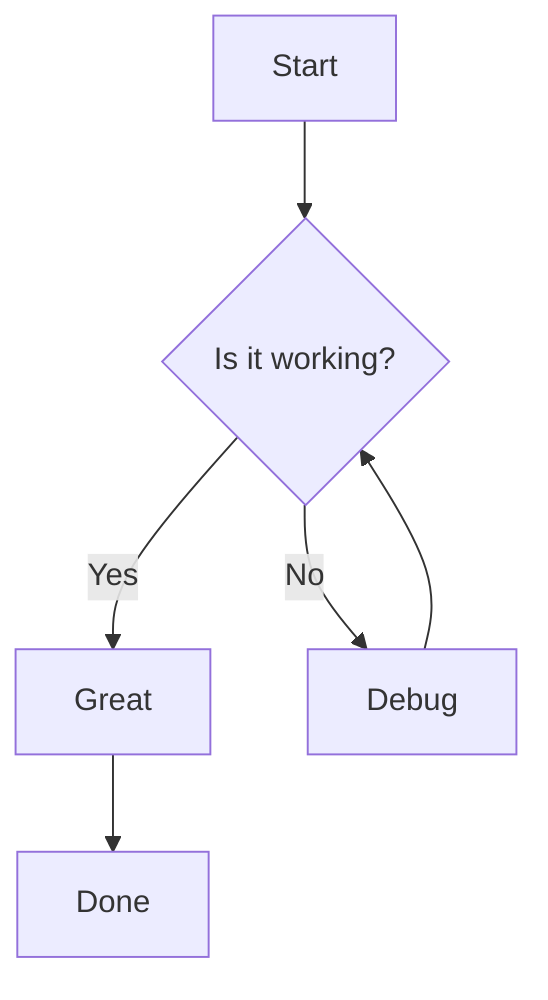
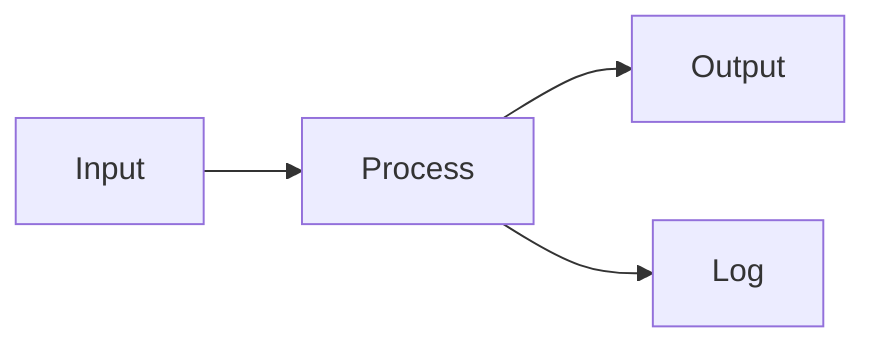
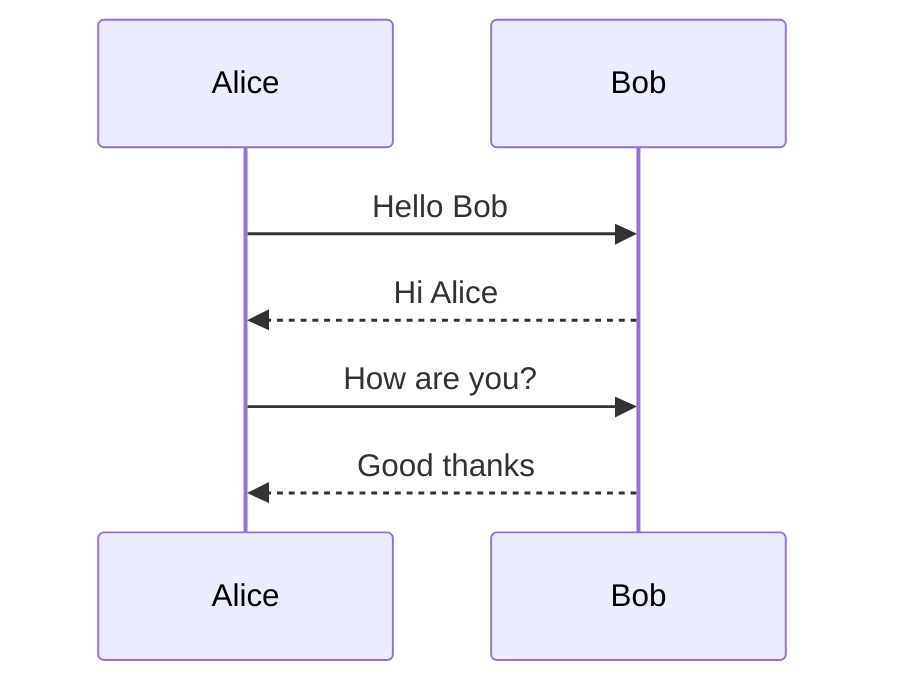
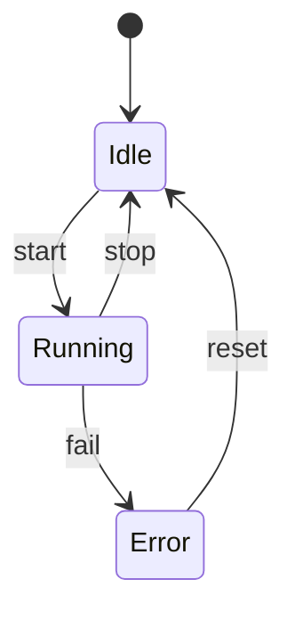
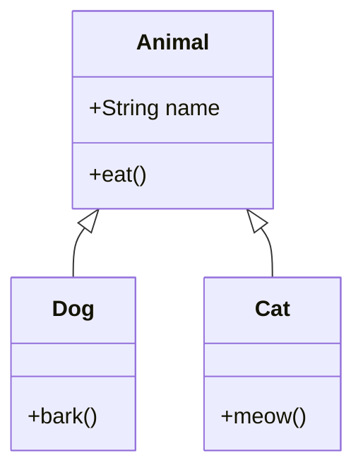
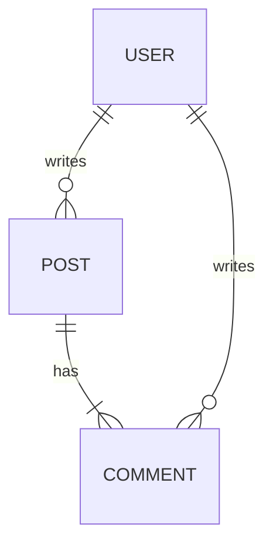

# Mermaid Rendering Test

## Flowchart (Top-Down)



## Flowchart (Left-Right)



## Sequence Diagram



## State Diagram



## Class Diagram



## ER Diagram



## Invalid (should fallback to raw source)

```mermaid
this is not valid mermaid at all
```

## Regular code block (unaffected)

```typescript
function hello(): string {
  return "world";
}
```
